<div align="center">

# EduManage — Education Management System


<p>
Robust, modern, and scalable school management system built with React + TypeScript (Vite) and Django REST Framework. Manage students, teachers, classes, grades, and attendance with role-based access for Admins, Teachers, and Students.
</p>

[](#) 
[](LICENSE) 
[](#) 
[](#) 
[](#)  
[](#) 
[](#) 
[](#) 
[](#)

</div>

---

## 🎯 Project Overview

EduManage streamlines school operations end-to-end. Administrators maintain the academic structure and users, teachers record attendance and grades, and students view their performance — all through a clean, responsive UI with secure JWT-based authentication.

Primary audience:
- School administrators who manage students, teachers, classes, and subjects
- Teachers who handle daily classroom operations (attendance, grades, rosters)
- Students who track grades, attendance, and personal information

## 🏗️ Architecture

**Frontend**
- React 18 + TypeScript
- Tailwind CSS + shadcn/ui
- Vite (dev server on port 8080)
- React Router, TanStack Query, Axios with interceptors

**Backend**
- Django + Django REST Framework
- SimpleJWT for authentication (access + refresh tokens)
- SQLite (dev) / PostgreSQL (prod)
- CORS enabled for the frontend during development

```mermaid
graph TB
    subgraph "Frontend - React + TypeScript"
        A[User Interface<br/>Tailwind + shadcn/ui]
        B[React Router<br/>Protected Routes]
        C[Auth Context<br/>JWT Token Management]
        D[Axios Client<br/>HTTP + Interceptors]
        E[TanStack Query<br/>State Management]
    end
    
    subgraph "Backend - Django REST Framework"
        F[API Gateway<br/>CORS + Middleware]
        G[JWT Authentication<br/>SimpleJWT]
        H[ViewSets + Serializers<br/>DRF]
        I[Business Logic<br/>Views + Models]
        J[(Database<br/>SQLite/PostgreSQL)]
    end
    
    A --> B
    B --> C
    C --> D
    D --> E
    E -->|HTTP Requests| F
    F --> G
    G --> H
    H --> I
    I --> J
    
    D -.->|401 Response| C
    C -.->|Refresh Token| G
    
    style A fill:#61dafb
    style F fill:#092E20
    style J fill:#336791
```

<details>
<summary>📊 System Architecture Diagram</summary>



**Component Overview:**
- React app (AuthContext, Protected Routes) → Axios (JWT attach + refresh) → DRF API
- DRF ViewSets for Admin APIs + legacy views for compatibility
- Users app with custom `role` field (admin, teacher, student)
- Core models: Student, Teacher, ClassRoom, Subject (code + title), Enrollment, Attendance, Grade, Report

</details>

## 📋 Feature Matrix

| Feature | Admin | Teacher | Student |
|---------|:-----:|:-------:|:-------:|
| **Dashboard Overview** | ✅ Full stats, activities, events | ✅ Classes, students, grades | ✅ Personal performance |
| **Student Management** | ✅ CRUD, import, export | ✅ View roster | ❌ |
| **Teacher Management** | ✅ CRUD, assignments | ❌ | ❌ |
| **Class Management** | ✅ Create, edit, schedule | ✅ View assigned | ✅ View enrolled |
| **Subject Management** | ✅ CRUD subjects | ✅ View subjects | ✅ View subjects |
| **Attendance Tracking** | ✅ View all records | ✅ Record & submit | ✅ View personal |
| **Grade Management** | ✅ View all grades | ✅ Record & edit | ✅ View personal |
| **Reports & Analytics** | ✅ System-wide reports | ✅ Class reports | ✅ Personal progress |
| **User Management** | ✅ Create/manage users | ❌ | ❌ |
| **Room/Resource Mgmt** | ✅ Manage rooms | ❌ | ❌ |


## 🚀 Quick Start

### Prerequisites
- Node.js 18+ and npm
- Python 3.10+
- Git

### 1) Clone the repository
```powershell
git clone <YOUR_GIT_URL>
cd "gleam-education-main"
```

### 2) Backend setup (Django + DRF)
```powershell
# move into backend
cd backend

# create and activate venv (Windows PowerShell)
python -m venv .venv
& .\.venv\Scripts\Activate

# install dependencies
pip install -r requirements.txt

# migrate and create a superuser
python manage.py migrate
python manage.py createsuperuser

# optional: seed convenient demo data
python create_subjects.py
python create_sample_data.py

# run the API
python manage.py runserver
```
Backend will serve at http://127.0.0.1:8000.

### 3) Frontend setup (React + Vite)
```powershell
# from repository root
cd ..

# install packages
npm install

# start the dev server (Vite on port 8080)
npm run dev
```
Frontend will serve at http://localhost:8080.

---

## 🐳 Docker Setup

Run the entire stack (frontend + backend + PostgreSQL) with Docker Compose:

<details>
<summary>📦 Docker Compose Configuration</summary>

Create `docker-compose.yml` in the project root:

```yaml
version: '3.8'

services:
  db:
    image: postgres:15-alpine
    environment:
      POSTGRES_DB: edu_db
      POSTGRES_USER: edu_user
      POSTGRES_PASSWORD: edu_pass
    volumes:
      - postgres_data:/var/lib/postgresql/data
    ports:
      - "5432:5432"
    healthcheck:
      test: ["CMD-SHELL", "pg_isready -U edu_user"]
      interval: 10s
      timeout: 5s
      retries: 5

  backend:
    build:
      context: ./backend
      dockerfile: Dockerfile
    command: >
      sh -c "python manage.py migrate &&
             python manage.py runserver 0.0.0.0:8000"
    volumes:
      - ./backend:/app
    ports:
      - "8000:8000"
    environment:
      - DEBUG=1
      - USE_SQLITE=0
      - POSTGRES_DB=edu_db
      - POSTGRES_USER=edu_user
      - POSTGRES_PASSWORD=edu_pass
      - POSTGRES_HOST=db
      - POSTGRES_PORT=5432
    depends_on:
      db:
        condition: service_healthy

  frontend:
    build:
      context: .
      dockerfile: Dockerfile.frontend
    volumes:
      - ./src:/app/src
      - ./public:/app/public
    ports:
      - "8080:8080"
    environment:
      - VITE_API_BASE=http://localhost:8000
    depends_on:
      - backend

volumes:
  postgres_data:
```

Create `backend/Dockerfile`:

```dockerfile
FROM python:3.11-slim

WORKDIR /app

COPY requirements.txt .
RUN pip install --no-cache-dir -r requirements.txt

COPY . .

EXPOSE 8000

CMD ["python", "manage.py", "runserver", "0.0.0.0:8000"]
```

Create `Dockerfile.frontend`:

```dockerfile
FROM node:18-alpine

WORKDIR /app

COPY package*.json ./
RUN npm install

COPY . .

EXPOSE 8080

CMD ["npm", "run", "dev", "--", "--host", "0.0.0.0"]
```

</details>

### Running with Docker

```bash
# Build and start all services
docker-compose up --build

# Run in detached mode
docker-compose up -d

# View logs
docker-compose logs -f

# Stop all services
docker-compose down

# Stop and remove volumes
docker-compose down -v
```

Access:
- Frontend: http://localhost:8080
- Backend API: http://localhost:8000
- PostgreSQL: localhost:5432


## 🔐 Authentication (JWT) and Roles

Flow:
1) Login: `POST /api/auth/token/` → returns `{ access, refresh }`
2) Authenticated requests include header `Authorization: Bearer <access>`
3) On 401, client automatically refreshes: `POST /api/auth/token/refresh/` → new `access`
4) Roles: `users.User.role ∈ { admin, teacher, student }` shape permissions and UI routes

Frontend stores tokens in `localStorage` and uses Axios interceptors for auto-attach and single-flight refresh.

## ✨ Key Features by Role

### 👨‍💼 Admin
- Manage Students, Teachers, ClassRooms, Subjects
- Enrollments, Grades, Attendance
- Dashboard: stats, activities, events

### 👩‍🏫 Teacher
- Class roster and details
- Record Attendance (daily/lesson)
- Record Grades (assignments, quizzes, tests, etc.)

### 🎓 Student
- Personal dashboard
- View Grades with letter/percent breakdown
- View Attendance history

## � API Endpoints Overview

Auth
- `POST /api/auth/token/` — obtain access/refresh
- `POST /api/auth/token/refresh/` — refresh access token

Users
- `GET /api/users/profile/` — authenticated profile

Admin (DRF router + legacy endpoints under `/api/admin/`)
- Students: `students/`, `students/stats/`, `students/create/`, `students/<id>/`
- Teachers: `teachers/`, `teachers/stats/`, `teachers/create/`, `teachers/<id>/`
- Classes: `classes/`, `classes/stats/`, `classes/create/`, `classes/<id>/`
- Subjects: `subjects/`, `subjects/create/`, `subjects/<id>/`
- Rooms: `rooms/`, `rooms/stats/`, `rooms/create/`, `rooms/<id>/`
- Grades: `grades/`, `grades/stats/`, `grades/<id>/`
- Attendance: `attendance/`, `attendance/<id>/`, `class-students/`
- Routers: `reports/`, `enrollments/`, `classrooms/`, `students/`, `teachers/`, `subjects/`, `grades/`, `attendance/`

Teacher (under `/api/teacher/`)
- `dashboard/`, `classes/`, `students/`, `grades/`
- `attendance/`, `attendance/submit/`
- `assignments/`, `assignments/create/`

### Student (under `/api/student/`)
- `dashboard/`, `courses/`, `assignments/`, `schedule/`, `grades/`, `attendance/`, `messages/`, `achievements/`

> Note: Actual permissions are enforced server-side using role-aware views and serializers.

### 📚 API Documentation

<details>
<summary>Interactive API Documentation</summary>

**Browsable API (DRF)**  
Navigate to http://127.0.0.1:8000/api/ for Django REST Framework's interactive browsable API.

**OpenAPI / Swagger (Optional)**  
To enable Swagger/OpenAPI documentation:

1. Install `drf-spectacular`:
   ```bash
   pip install drf-spectacular
   ```

2. Add to `backend/edu_backend/settings.py`:
   ```python
   INSTALLED_APPS += ['drf_spectacular']
   
   REST_FRAMEWORK = {
       'DEFAULT_SCHEMA_CLASS': 'drf_spectacular.openapi.AutoSchema',
   }
   ```

3. Add to `backend/edu_backend/urls.py`:
   ```python
   from drf_spectacular.views import SpectacularAPIView, SpectacularSwaggerView
   
   urlpatterns += [
       path('api/schema/', SpectacularAPIView.as_view(), name='schema'),
       path('api/docs/', SpectacularSwaggerView.as_view(url_name='schema'), name='swagger-ui'),
   ]
   ```

4. Access Swagger UI at: http://127.0.0.1:8000/api/docs/

</details>


## 📂 Folder Structure

```
gleam-education-main/
├─ backend/
│  ├─ admin_api/                 # Admin domain models, serializers, views, urls
│  ├─ edu_backend/               # Django project settings/urls
│  ├─ student/                   # Student-facing endpoints
│  ├─ teacher/                   # Teacher-facing endpoints
│  ├─ users/                     # Custom user (role), auth helpers
│  ├─ manage.py                  # Django entrypoint
│  ├─ requirements.txt           # Backend deps
│  └─ db.sqlite3                 # Dev DB (if using SQLite)
├─ src/
│  ├─ components/                # Reusable UI (shadcn/ui, layout, ErrorBoundary)
│  ├─ hooks/                     # Custom hooks (e.g., use-toast)
│  ├─ lib/                       # api.ts, http client, auth context, utils
│  ├─ pages/                     # Pages (Admin, Teacher, Student)
│  ├─ App.tsx / main.tsx         # App bootstrap
│  └─ index.css / tailwind setup # Styling
├─ public/                       # Static assets
├─ package.json                  # Frontend scripts and deps
├─ vite.config.ts                # Vite config (port 8080)
├─ tailwind.config.ts            # Tailwind config
├─ tsconfig*.json                # TS configs
└─ README.md
```

## ⚙️ Environment Variables

### Backend (`backend/.env`)
```env
# Core
DJANGO_SECRET_KEY=your-secret-key
DEBUG=1
ALLOWED_HOSTS=localhost,127.0.0.1

# Database (dev defaults to SQLite)
USE_SQLITE=1

# PostgreSQL (prod)
POSTGRES_DB=edu_db
POSTGRES_USER=edu_user
POSTGRES_PASSWORD=edu_pass
POSTGRES_HOST=localhost
POSTGRES_PORT=5432

# JWT lifetimes
ACCESS_TOKEN_MINUTES=60
REFRESH_TOKEN_DAYS=7
```

### Frontend (`.env`)
```env
VITE_API_BASE=http://localhost:8000
```

## 🧪 Testing

### Backend Tests

The backend uses Django's built-in test framework. For enhanced testing with pytest:

```powershell
# Using Django's test runner
cd backend
& .\.venv\Scripts\Activate
python manage.py test

# Run specific app tests
python manage.py test admin_api
python manage.py test users

# With coverage
pip install coverage
coverage run --source='.' manage.py test
coverage report
coverage html  # Generate HTML report
```

<details>
<summary>🔬 Setting up pytest (optional)</summary>

Install pytest and plugins:
```bash
pip install pytest pytest-django pytest-cov
```

Create `backend/pytest.ini`:
```ini
[pytest]
DJANGO_SETTINGS_MODULE = edu_backend.settings
python_files = tests.py test_*.py *_tests.py
addopts = --cov=. --cov-report=html --cov-report=term
```

Run pytest:
```bash
pytest
pytest --cov
pytest -v --cov-report=html
```

</details>

### Frontend Tests

The frontend can use Vitest for unit/component testing:

```bash
# Install testing dependencies
npm install -D vitest @testing-library/react @testing-library/jest-dom jsdom

# Add to package.json scripts
"test": "vitest",
"test:ui": "vitest --ui",
"test:coverage": "vitest --coverage"
```

<details>
<summary>⚙️ Vitest Configuration</summary>

Create `vitest.config.ts`:
```typescript
import { defineConfig } from 'vitest/config';
import react from '@vitejs/plugin-react-swc';
import path from 'path';

export default defineConfig({
  plugins: [react()],
  test: {
    globals: true,
    environment: 'jsdom',
    setupFiles: './src/test/setup.ts',
    coverage: {
      provider: 'v8',
      reporter: ['text', 'html', 'lcov'],
    },
  },
  resolve: {
    alias: {
      '@': path.resolve(__dirname, './src'),
    },
  },
});
```

Create `src/test/setup.ts`:
```typescript
import '@testing-library/jest-dom';
```

Example test (`src/components/__tests__/Button.test.tsx`):
```typescript
import { render, screen } from '@testing-library/react';
import { describe, it, expect } from 'vitest';
import { Button } from '../ui/button';

describe('Button', () => {
  it('renders correctly', () => {
    render(<Button>Click me</Button>);
    expect(screen.getByText('Click me')).toBeInTheDocument();
  });
});
```

</details>

**Run Tests:**
```bash
npm run test          # Run all tests
npm run test:ui       # Interactive UI
npm run test:coverage # With coverage report
```

### E2E Testing (Optional)

For end-to-end tests, consider Playwright:
```bash
npm install -D @playwright/test
npx playwright install

# Run E2E tests
npx playwright test
```


## 🚢 Deployment

Production checklist:
- Set `DEBUG=0` and proper `ALLOWED_HOSTS`
- Use PostgreSQL and configure env vars
- Run `python manage.py migrate`
- Create a superuser
- Build frontend: `npm run build` and deploy `dist/` to a static host (or serve via Django/Nginx)
- Serve Django with Gunicorn/Uvicorn behind Nginx (or your platform's PaaS)
- Configure CORS appropriately

Optional enhancements:
- Static files handling (Whitenoise / CDN)
- HTTPS and reverse proxy
- CI/CD pipeline for lint/build/test

---

## 📸 Demo & Screenshots

> 🎬 **Live Demo:** _Coming soon!_

<details>
<summary>🖼️ Screenshots</summary>

### Admin Dashboard

_Comprehensive overview with stats, recent activities, and quick actions_

### Teacher Portal

_Easy attendance recording with class roster_

### Student View

_Clear grade breakdown with performance analytics_

### Login & Authentication

_Secure JWT-based authentication_

> **Note:** Add your screenshots to `docs/screenshots/` directory.

</details>

---

## 🗺️ Project Roadmap

### ✅ Completed
- [x] Core authentication system (JWT)
- [x] Role-based access control (Admin, Teacher, Student)
- [x] Student & Teacher management
- [x] Class & Subject management
- [x] Attendance tracking
- [x] Grade management with letter grades
- [x] Responsive UI with Tailwind + shadcn/ui
- [x] Auto token refresh mechanism
- [x] Dashboard analytics

### 🚧 In Progress
- [ ] Enhanced reporting system
- [ ] Bulk import/export features
- [ ] Email notifications
- [ ] Assignment submission system

### 🔮 Future Enhancements
- [ ] **Mobile App** (React Native / Flutter)
- [ ] **Real-time notifications** (WebSockets)
- [ ] **Advanced Analytics** (charts, trends, predictions)
- [ ] **Parent Portal** (view child's progress)
- [ ] **Fee Management** (billing, payments, receipts)
- [ ] **Library Management** (book tracking, due dates)
- [ ] **Exam Scheduler** (timetable, hall allocation)
- [ ] **Multi-language Support** (i18n)
- [ ] **Calendar Integration** (Google Calendar, iCal)
- [ ] **File Upload** (assignments, documents)
- [ ] **Chat/Messaging** (teacher-student, admin-teacher)
- [ ] **Attendance Biometric Integration**
- [ ] **SMS Gateway** for alerts
- [ ] **Dark Mode** theme
- [ ] **Progressive Web App** (PWA) support
- [ ] **AI-powered insights** (student performance predictions)

### 💡 Suggestions?
Have ideas for new features? [Open an issue](../../issues) or submit a pull request!


## 🧰 Technologies Used

- Frontend: React, TypeScript, Vite, Tailwind CSS, shadcn/ui, React Router, TanStack Query, Axios
- Backend: Django, Django REST Framework, SimpleJWT, django-cors-headers, psycopg2-binary
- Database: SQLite (dev), PostgreSQL (prod)

## 🤝 Contributing

Contributions are welcome!
1. Fork the repo
2. Create a feature branch: `git checkout -b feat/amazing`
3. Commit: `git commit -m "feat: add amazing"`
4. Push: `git push origin feat/amazing`
5. Open a Pull Request

## 📄 License

MIT License. See [LICENSE](LICENSE) for details.

## 🙌 Credits

- Built using open-source libraries by the React, Django, and DRF communities
- UI components inspired by shadcn/ui
- Icons by Lucide and Font Awesome

---

Made with ❤️ for schools and educators.
